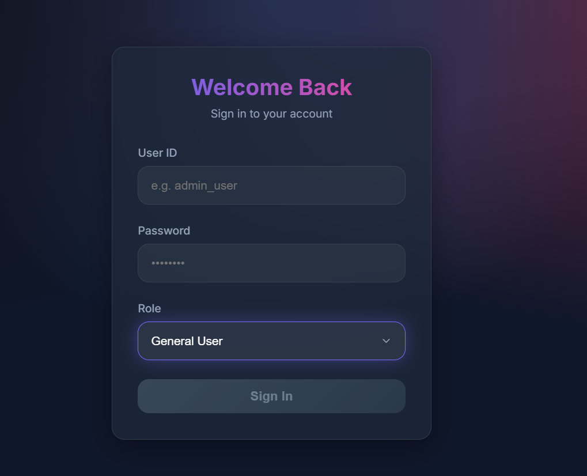
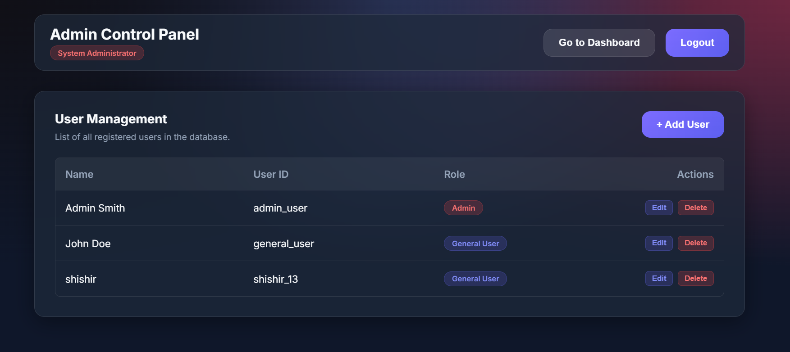
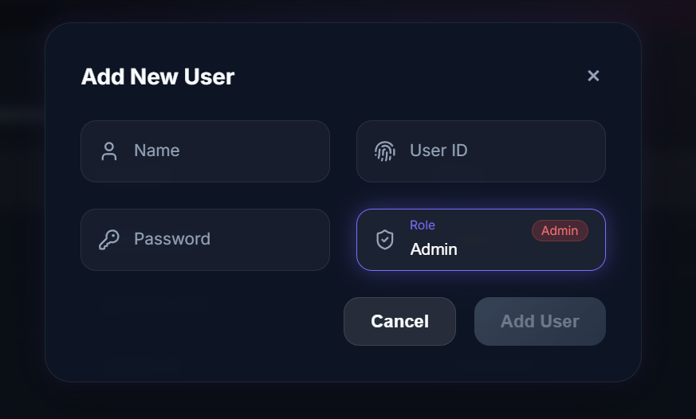
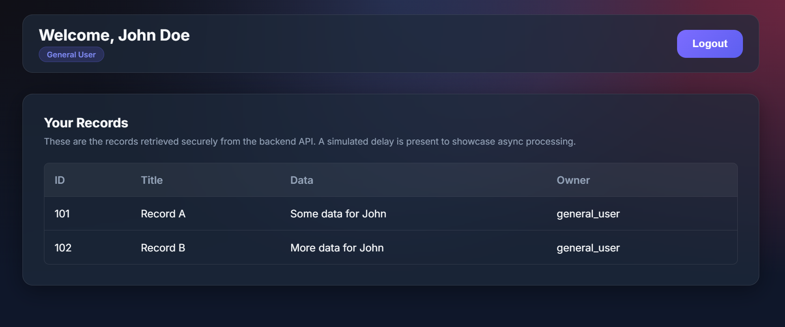

# Role-Based Ticket Management System

A modern full-stack Single Page Application (SPA) built using Angular and Node.js to demonstrate role-based authentication, user management, asynchronous API handling, and a premium glassmorphism UI design.

This project was developed as part of a Software Engineer Internship code challenge.

---

# Live Demo

## Frontend (Vercel)
https://angular-role-based-app-k8rq.vercel.app/login

## Backend API (Render)
https://angular-role-based-app.onrender.com

---

# Application Screenshots

## Login Page



---

## Admin Dashboard



---

## Add User Modal



---

## General User Dashboard



---

# Features

- Role-based authentication system
- Admin and General User access control
- Full CRUD user management
- User-specific records dashboard
- Async API delay simulation with loading states
- Modern glassmorphism UI design
- Reactive Angular forms and modular architecture
- JSON-based mock database integration
- REST API integration
- Protected admin functionality
- Responsive and professional dashboard UI
- Modular frontend and backend structure

---

# Tech Stack

## Frontend
- Angular
- TypeScript
- SCSS
- RxJS
- Reactive Forms

## Backend
- Node.js
- Express.js
- TypeScript
- Nodemon

## Deployment
- Vercel (Frontend Hosting)
- Render (Backend API Hosting)

## Database
- Local JSON File (`db.json`) used as a mock database

---

# Project Structure

```bash
angular-role-based-app/
├── backend/
│   ├── src/
│   │   └── index.ts
│   ├── db.json
│   ├── package.json
│   └── tsconfig.json
│
├── frontend/
│   ├── src/app/
│   │   ├── components/
│   │   ├── services/
│   │   ├── app.config.ts
│   │   └── app.routes.ts
│   │
│   ├── src/styles.scss
│   └── package.json
│
├── screenshots/
│   ├── login.png
│   ├── admin-dashboard.png
│   ├── add-user-modal.png
│   └── user-dashboard.png
│
├── README.md
└── .gitignore
```

---

# API Documentation

The backend exposes several REST API endpoints and supports asynchronous delay simulation using query parameters.

## Authentication
- `POST /api/login`
  - Validates credentials and returns authenticated user details.

## Records
- `GET /api/records`
  - Fetches records based on user access level.
  - Supports delay simulation.

## User Management (Admin Only)

- `GET /api/users`
  - Returns all registered users.

- `POST /api/users`
  - Creates a new user.

- `PUT /api/users/:id`
  - Updates an existing user.

- `DELETE /api/users/:id`
  - Deletes a user.

---

# Async API Simulation

To demonstrate asynchronous API processing and loading states, the backend supports a delay parameter.

Example:

```bash
/api/users?delay=1500
```

This intentionally delays the response to simulate real-world API latency.

---

# Setup & Installation

You need two terminal windows to run this full-stack application locally.

---

## 1. Start Backend API

```bash
cd backend
npm install
npm start
```

Backend runs on:

```bash
http://localhost:3000
```

---

## 2. Start Angular Frontend

```bash
cd frontend
npm install
npm start
```

Frontend runs on:

```bash
http://localhost:4200
```

---

# Role-Based Access

| Role | Permissions |
|------|-------------|
| Admin | Full CRUD access, user management, dashboard access |
| General User | Dashboard access with user-specific records |

---

# Test Credentials

## Admin Account

```bash
User ID: admin_user
Password: password123
Role: Admin
```

---

## General User Account

```bash
User ID: general_user
Password: password123
Role: General User
```

---

# Database Behavior (Local vs Live Deployment)

This project uses a lightweight JSON-based mock database (`db.json`) for demonstration purposes.

---

## Local Development

When running locally:

- newly added users
- edited users
- deleted users

are permanently stored inside `db.json`.

This works because the backend has direct filesystem access on the local machine.

---

## Live Deployment Behavior

In the live deployed environment (Render), the backend runs on a temporary cloud instance.

Because of this:

- runtime changes to `db.json` may not persist permanently
- newly created users can disappear after redeploy/restart
- the cloud filesystem is ephemeral (temporary)

This is expected behavior when using file-based storage in cloud hosting environments.

---

# Why JSON Database Was Used

The assignment requirements allowed:

- local storage
- XML
- MongoDB
- AWS DynamoDB

A JSON-based mock database was intentionally used to:

- simplify project setup
- focus on Angular architecture
- demonstrate REST API integration
- implement role-based access control
- showcase asynchronous processing
- create a clean modular full-stack application

---

# Future Improvements

Possible production-grade upgrades:

- MongoDB Atlas integration
- AWS DynamoDB integration
- JWT authentication
- Password hashing using bcrypt
- Persistent cloud database storage
- Pagination and search
- Role permissions middleware
- Docker deployment

---

# Evaluation Highlights

This project demonstrates:

- Angular modular architecture
- Reactive forms
- Role-based authorization
- REST API integration
- Async handling and loading states
- Full CRUD operations
- Modern responsive UI design
- Clean code organization
- Cloud deployment workflow

---

# Author

## Shishir Mahato

B.Tech CSE (Data Science)

### Tech Focus
- Frontend: Angular + SCSS
- Backend: Node.js + TypeScript
- Deployment: Vercel + Render
